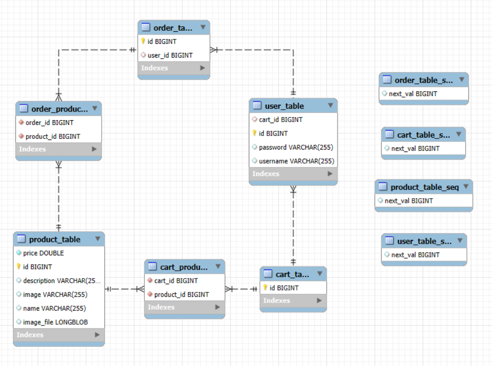

# 🛍️ **Burgos CF Store**  
¡Bienvenido a la tienda del Burgos CF!  

---

## 👥 **Equipo de desarrollo**
### **Integrantes**
- 🧑‍💻 **Mario Serrano García**  
  📧 *m.serranog.2023@alumnos.urjc.es*  
  🌐 [GitHub: @marioserraano](https://github.com/marioserraano)

- 🧑‍💻 **Carlos Gutiérrez Carpintero**  
  📧 *c.gutierrezc.2023@alumnos.urjc.es*  
  🌐 [GitHub: @Carlosgcov](https://github.com/Carlosgcov)

- 🧑‍💻 **Alejandro Torres Montes**  
  📧 *a.torresmo.2023@alumnos.urjc.es*  
  🌐 [GitHub: @Torressss7](https://github.com/Torressss7)

---

## 🌟 **Aspectos principales de la aplicación**
### **📋 Entidades principales**
La aplicación gestiona las siguientes entidades:  
- **👤 User:** Usuarios registrados con carrito y pedidos.  
- **🛒 Cart:** Carrito de compras asociado a un usuario.  
- **📦 Order:** Pedido realizado por un usuario.  
- **🛍️ Product:** Productos disponibles en la tienda.  

### **🔗 Relaciones entre entidades**
- Un **User** tiene un **Cart** y puede tener múltiples **Orders**.  
- Un **Order** puede contener múltiples **Products**.  
- Un **Product** puede estar asociado a múltiples **Orders**.  

---

### **🔐 Permisos de los usuarios**
- **Usuario por defecto:**   
  - ✅ Ver información general de la web.
  - ✅ Acceder a la página de contacto.
  - ✅ Visualizar productos.  
  - ✅ Iniciar sesión de un usuario existente.  
  - ✅ Registrarse como nuevo usuario.
  - **Usuario registrado:**  
  - ✅ Añadir y eliminar pedidos a su carrito.  
  - ✅ Realizar y borrar sus pedidos.  
  - ✅ Borrar su cuenta.
  - ✅ Cambiar su usuario y contraseña.
  - ✅ Cambiar su nombre y su descripción.  
  - ✅ Subir y descargar una foto de su DNI.  
  - **Administrador:**  
  - ✅ Añadir, editar y borrar productos.  
  - ✅ Visualizar y eliminar pedidos de cualquier usuario.  
  - ✅ Visualizar carritos de compra de otros usuarios.  
  - ✅ Eliminar cualquier usuario.  

---

### **🖼️ Imágenes**
- Cada **Product** tiene asociada una imagen.  
- Cada **User** puede subir una imágen de su DNI. 

---

## 📊 **Diagrama de entidades**
  

---

## 🤝 **Desarrollo colaborativo**
### **📌 Participación de los miembros del equipo**

#### 🧑‍💻 **Mario Serrano García**  
- **Tareas realizadas:**  
  - Implementación de la API (RestControllers, Mappers y DTOs).
  - Implementación de la BBDD utilizando Repositorios.
  - Arreglos en el funcionamiento de la web, base de datos y API.
- **Commits más significativos:**  
  1. [RestControllers, DTOs y Mappers terminados](https://github.com/DWS-2025/project-grupo-11/commit/b0722ef9d8c5ea227cbe2784bea0a53a1bc6f6e2)  
  2. [Cambios para comenzar a usar la BBDD](https://github.com/DWS-2025/project-grupo-11/commit/17547b6ce8c3227683883c94628d75c3c933b94a)  
  3. [Adición SimpleDTOs para solucionar referencias circulares](https://github.com/DWS-2025/project-grupo-11/commit/ef6b1ffe7bde85881fc6e3dfa918f08f4498e21d)  
  4. [Cambios en las clases para seguir integrando la base de datos](https://github.com/DWS-2025/project-grupo-11/commit/7e3293e5d3b69ed2d7716a7994e73282b50e7278)  
  5. [Arreglo Funcionamiento Mappers](https://github.com/DWS-2025/project-grupo-11/commit/56827cdb21d13ea9aef59b9e9203ab57c0ae3dbf)  
- **Ficheros más editados:**  
  - `src/main/java/grupo11/bcf_store/controller/rest/ProductRestController.java`  
  - `src/main/java/grupo11/bcf_store/service/ProductService.java`  
  - `src/main/java/grupo11/bcf_store/controller/rest/OrderRestController.java`  
  - `src/main/java/grupo11/bcf_store/service/CartService.java`  
  - `src/main/java/grupo11/bcf_store/model/Cart.java`

#### 🧑‍💻 **Carlos Gutiérrez Carpintero**  
- **Tareas realizadas:**  
  - Funcionalidades de texto enriquecido y ficheros guardados en disco.  
  - Creación de nuevos métodos de los usuarios.  
  - Corrección de errores y vulnerabilidades.  
- **Commits más significativos:**  
  1. [Comienzo funcionamiento de sesiones y usuarios](https://github.com/DWS-2025/project-grupo-11/commit/bc88239ee89f367ec101b5a688b3c92f88e06daf)  
  2. [Asociación de carrito y pedido con el id del usuario. Registro de nuevos usuarios y su cartid. No mostrar botones si no se tiene permisos de ADMIN o si no se está registrado.](https://github.com/DWS-2025/project-grupo-11/commit/9b430a259d9e5dffa5e562c7049cdfbc6e9550bc)   
  3.  [Añadida funcionalidad de subir DNI de un usuario como archivo en disco.](https://github.com/DWS-2025/project-grupo-11/commit/6bfd1ed176e214849d100effbfa3aba53d255a74)
  4. [Mejora y protección de subida de imágenes en BBDD y en disco](https://github.com/DWS-2025/project-grupo-11/commit/f918932d96082cbc8df7531b7a25668f255a4efc)  
  5. [Arreglada la modificación de credenciales e información de usuarios y corrección de problemas.](https://github.com/DWS-2025/project-grupo-11/commit/c96a5bc09c087c4abd74dae0fa04ef032449f99f)  
- **Ficheros más editados:**  
  - `src/main/java/grupo11/bcf_store/security/SecurityConfiguration.java`  
  - `src/main/java/grupo11/bcf_store/controller/web/UserWebController.java`  
  - `src/main/resources/templates/private.html`  
  - `src/main/resources/templates/admin.html`  
  - `src/main/java/grupo11/bcf_store/service/UserService.java`